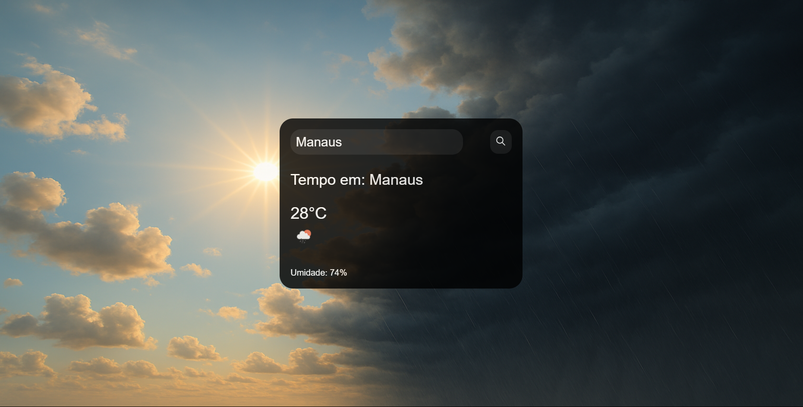

# 🌦️ Aplicativo de Previsão do Tempo com Backend

Este projeto é uma aplicação web simples que mostra a **previsão do tempo em tempo real** com **autocomplete de cidades**, utilizando a API da OpenWeatherMap. A aplicação inclui um backend em Node.js para proteger a chave da API e evitar seu uso direto no front-end.

---

## 📸 Preview



---

## 🧩 Funcionalidades

- 🔎 Autocomplete de cidades conforme o usuário digita.
- 🌡️ Exibe temperatura atual.
- 💧 Exibe umidade do ar.
- 🌥️ Ícone correspondente à condição do tempo.
- 🔐 Chave da API protegida no backend.
- 🎨 Interface visual.

---

## 🛠️ Tecnologias Utilizadas

- **Front-end:** HTML, CSS, JavaScript
- **Back-end:** Node.js, Express
- **APIs:** [OpenWeatherMap](https://openweathermap.org/api)

---

## 🚀 Como rodar o projeto localmente

### 🔧 1. Clonar o repositório

```bash
git clone https://github.com/seu-usuario/weather-app.git
cd weather-app

---

📦 2. Configurar o backend

```bash
cd backend
npm install

Crie um arquivo .env com sua chave da API:
OPENWEATHER_API_KEY=coloque_sua_chave_aqui

Inicie o servidor:
node index.js
O backend estará rodando em: http://localhost:3000

🌐 3. Abrir o front-end
Abra o arquivo frontend/index.html no navegador.

O script.js está configurado para consumir o backend local (porta 3000).

🔐 Proteção da API
Neste projeto, a chave da API é armazenada no backend, impedindo o acesso direto no front-end e evitando abusos ou vazamentos.

📌 Observações
O autocomplete usa a API de geocodificação direta da OpenWeatherMap.

O projeto pode ser adaptado para exibir mais dados (vento, sensação térmica, previsão por hora etc).
